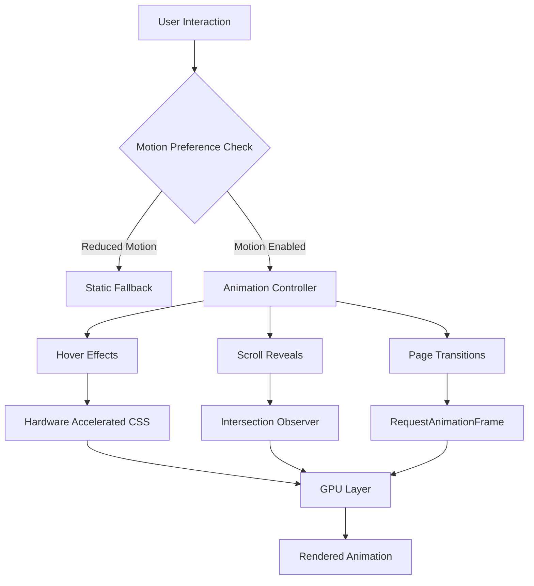
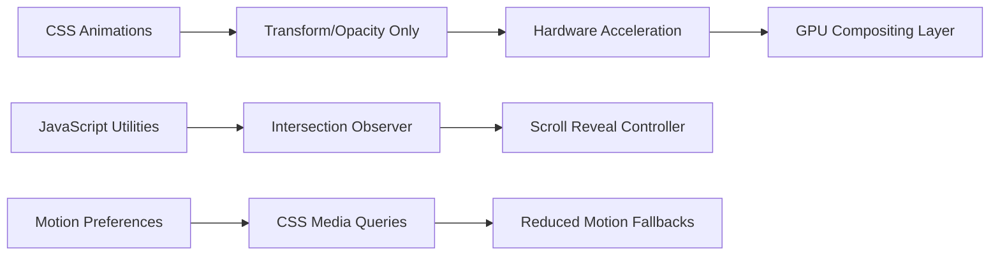

# Design Document

## Overview

This design outlines the implementation of modern CSS animations and micro-interactions for the Mulsower SV 61 website. The solution focuses on performance-first animations using hardware-accelerated properties, progressive enhancement, and accessibility compliance. All animations will be implemented using pure CSS/Tailwind with minimal JavaScript utilities for scroll detection and reduced motion handling.

The design prioritizes the "wow factor" through subtle, professional animations that enhance user experience without compromising the site's static nature or performance standards.

## Architecture

### Animation System Architecture



### Performance Architecture



## Components and Interfaces

### 1. Animation Utility System

#### Tailwind Configuration Extensions (CSS Variables + Theme)
```typescript
// tailwind.config.js extensions
export default {
  theme: {
    extend: {
      transitionTimingFunction: {
        standard: 'cubic-bezier(0.2,0,0,1)',
        emphasis: 'cubic-bezier(0.3,0,0,1)'
      },
      transitionDuration: {
        fast: '150ms',
        base: '180ms', 
        slow: '220ms'
      },
      animation: {
        'fade-in': 'fadeIn 180ms cubic-bezier(0.2,0,0,1)',
        'slide-up': 'slideUp 200ms cubic-bezier(0.2,0,0,1)',
        'scale-in': 'scaleIn 150ms cubic-bezier(0.2,0,0,1)'
      }
    }
  }
}
```

#### Core Animation Classes (Transform/Opacity Only)
```css
/* CSS Variables for centralized motion tokens */
:root {
  --ease-standard: cubic-bezier(0.2,0,0,1);
  --ease-emphasis: cubic-bezier(0.3,0,0,1);
  --duration-fast: 150ms;
  --duration-base: 180ms;
  --duration-slow: 220ms;
}

/* Base reveal utility - content visible by default */
.reveal {
  opacity: 0;
  transform: translateY(12px);
  transition: opacity var(--duration-base) var(--ease-standard),
              transform var(--duration-base) var(--ease-standard);
}

.reveal.in {
  opacity: 1;
  transform: none;
}

/* Mandatory reduced motion fallbacks */
@media (prefers-reduced-motion: reduce) {
  .reveal {
    transition: none;
    opacity: 1;
    transform: none;
  }
  
  html {
    scroll-behavior: auto;
  }
  
  /* Disable all animations */
  *, *::before, *::after {
    animation-duration: 0.01ms !important;
    animation-iteration-count: 1 !important;
    transition-duration: 0.01ms !important;
  }
}
```

### 2. Hover Effect System

#### Button Hover Effects (Transform/Opacity Only)
```css
.btn-hover {
  transition: transform 150ms cubic-bezier(0.2,0,0,1),
              opacity 150ms cubic-bezier(0.2,0,0,1);
}

@media (hover: hover) and (pointer: fine) {
  .btn-hover:hover {
    transform: translateY(-1px) scale(1.02);
  }
}

@media (hover: none) and (pointer: coarse) {
  .btn-hover:active {
    transform: scale(0.98);
    transition-duration: 80ms;
  }
}
```

#### Sponsor Card Effects (Pseudo-element Shadow Animation)
```css
.sponsor-card {
  position: relative;
  transition: transform 180ms cubic-bezier(0.2,0,0,1);
}

.sponsor-card::before {
  content: "";
  position: absolute;
  inset: 0;
  box-shadow: 0 20px 40px -10px rgba(0, 0, 0, 0.15);
  opacity: 0;
  transition: opacity 180ms cubic-bezier(0.2,0,0,1);
  pointer-events: none;
}

@media (hover: hover) and (pointer: fine) {
  .sponsor-card:hover {
    transform: translateY(-2px) scale(1.02);
  }
  
  .sponsor-card:hover::before {
    opacity: 1;
  }
}
```

### 3. Scroll Reveal System

#### Intersection Observer Controller (Resilient Implementation)
```typescript
interface ScrollRevealConfig {
  threshold: number;        // 0.15
  rootMargin: string;      // '0px 0px -15% 0px' (percentage-based)
  staggerDelay: number;    // 60ms
  maxGroupDelay: number;   // 400ms (hard limit)
}

class ScrollRevealController {
  private observer: IntersectionObserver;
  private elements: Map<Element, RevealConfig>;
  
  constructor(config: ScrollRevealConfig) {
    // Initialize with safe defaults - content visible by default
    this.observer = new IntersectionObserver(
      this.handleIntersection.bind(this),
      {
        threshold: config.threshold,
        rootMargin: config.rootMargin
      }
    );
  }
  
  // Only add .reveal class after observer is ready
  observe(element: Element, config?: Partial<RevealConfig>): void {
    element.classList.add('reveal');
    this.observer.observe(element);
  }
  
  unobserve(element: Element): void;
  private handleIntersection(entries: IntersectionObserverEntry[]): void;
}
```

#### Staggered Animation Implementation (Content Visibility + Safe Defaults)
```css
/* Content visible by default - no blank page if JS fails */
.stagger-group > * {
  /* No initial opacity: 0 - content is visible by default */
}

/* Only apply reveal styles after JS adds the class */
.stagger-group.reveal > * {
  opacity: 0;
  transform: translateY(20px);
  transition: opacity 200ms cubic-bezier(0.2,0,0,1),
              transform 200ms cubic-bezier(0.2,0,0,1);
}

.stagger-group.reveal.animate > *:nth-child(1) { transition-delay: 0ms; }
.stagger-group.reveal.animate > *:nth-child(2) { transition-delay: 60ms; }
.stagger-group.reveal.animate > *:nth-child(3) { transition-delay: 120ms; }
.stagger-group.reveal.animate > *:nth-child(4) { transition-delay: 180ms; }
/* Cap at 400ms total group delay */

.stagger-group.reveal.animate > * {
  opacity: 1;
  transform: none;
}

/* Content visibility for performance */
section[data-heavy] {
  content-visibility: auto;
  contain-intrinsic-size: 1px 800px;
}
```

### 4. Page Transition System

#### Global Page Fade Controller (BFCache Safe)
```typescript
class PageTransitionController {
  private static readonly FADE_DURATION = 180;
  
  static initializePageFade(): void {
    document.body.style.opacity = '0';
    requestAnimationFrame(() => {
      document.body.style.transition = `opacity ${this.FADE_DURATION}ms cubic-bezier(0.2,0,0,1)`;
      document.body.style.opacity = '1';
    });
    
    // Handle back/forward cache to prevent flash
    window.addEventListener('pageshow', (e) => {
      if (e.persisted) {
        document.body.style.opacity = '1';
      }
    });
  }
  
  static handleSmoothScroll(): void {
    // CSS-based smooth scroll with reduced motion support
    // Implementation moved to CSS for better performance
  }
  
  static initializeHeroAnimation(): void {
    // Wait for hero image decode before animating text
    const heroImg = document.querySelector('#hero-img') as HTMLImageElement;
    heroImg?.decode?.().then(() => {
      document.documentElement.classList.add('hero-ready');
    }).catch(() => {
      // Fallback if decode fails
      document.documentElement.classList.add('hero-ready');
    });
  }
}
```

#### CSS-Based Smooth Scroll (Reduced Motion Safe)
```css
/* Only enable smooth scroll when motion is not reduced */
@media (prefers-reduced-motion: no-preference) {
  html {
    scroll-behavior: smooth;
  }
}

@media (prefers-reduced-motion: reduce) {
  html {
    scroll-behavior: auto;
  }
}
```

## Data Models

### Animation State Management (Feature Detection Safe)

```typescript
interface AnimationState {
  motionPreference: 'reduce' | 'no-preference';
  deviceCapabilities: {
    supportsHover: boolean;
    isTouch: boolean;
    hasLimitedMemory: boolean;
    hasSaveData: boolean;
  };
  performanceMetrics: {
    isHighPerformance: boolean;
    supportsHardwareAcceleration: boolean;
  };
}

interface RevealConfig {
  element: Element;
  animationType: 'fade' | 'slide-up' | 'slide-left' | 'scale';
  delay: number;
  duration: number;
  easing: string;
}

// Safe feature detection with fallbacks
class DeviceCapabilities {
  static checkSaveData(): boolean {
    return 'connection' in navigator && 
           (navigator as any).connection?.saveData === true;
  }
  
  static checkLowMemory(): boolean {
    return 'deviceMemory' in navigator && 
           (navigator as any).deviceMemory && 
           (navigator as any).deviceMemory <= 4;
  }
  
  static shouldReduceAnimations(): boolean {
    return this.checkSaveData() || 
           this.checkLowMemory() ||
           window.matchMedia('(prefers-reduced-motion: reduce)').matches;
  }
}
```

### Performance Monitoring (Development Only)

```typescript
interface PerformanceMetrics {
  animationFrameTime: number;
  layoutShifts: number;
  longTasks: number;
  memoryUsage?: number;
}

class PerformanceMonitor {
  // Only enable in development to avoid production overhead
  static isEnabled = process.env.NODE_ENV !== 'production';
  
  static checkDeviceCapabilities(): DeviceCapabilities {
    if (!this.isEnabled) return {} as DeviceCapabilities;
    // Implementation only in development
  }
  
  static monitorAnimationPerformance(): PerformanceMetrics {
    if (!this.isEnabled) return {} as PerformanceMetrics;
    // Frame rate and long task monitoring
  }
  
  static shouldReduceAnimations(): boolean {
    return DeviceCapabilities.shouldReduceAnimations();
  }
}
```

## Error Handling

### Graceful Degradation Strategy

1. **Motion Preference Detection (Mandatory)**
   - Primary: CSS `@media (prefers-reduced-motion: reduce)` with complete animation disable
   - Fallback: JavaScript `window.matchMedia` check for dynamic control
   - Override: HTML `data-motion="reduced"` attribute for force-disable

2. **Hardware Acceleration Fallbacks**
   - Use `@supports` queries for backdrop-filter with solid fallbacks
   - Implement will-change sparingly (add before animation, remove after)
   - Provide transform fallbacks for older browsers

3. **Performance Degradation (Progressive Enhancement)**
   - Monitor frame rates during animations (development only)
   - Automatically reduce complexity on low-end devices via feature detection
   - Disable non-essential animations under resource constraints

#### Backdrop Blur Safe Implementation
```css
.overlay {
  background: rgba(255, 255, 255, 0.75);
}

@supports (backdrop-filter: blur(6px)) {
  .overlay {
    backdrop-filter: blur(6px);
    background: rgba(255, 255, 255, 0.4);
  }
}
```

#### Will-Change Usage Pattern
```css
/* Add will-change just before expensive animation */
.element-about-to-animate {
  will-change: transform;
}

/* Remove after animation completes */
.element-animation-complete {
  will-change: auto;
}
```

### Error Recovery Mechanisms

```typescript
class AnimationErrorHandler {
  static handleIntersectionObserverError(error: Error): void {
    console.warn('Scroll animations disabled due to observer error:', error);
    // Fallback to immediate visibility - content was visible by default
    document.querySelectorAll('.reveal').forEach(el => {
      el.classList.add('in');
    });
  }
  
  static handlePerformanceIssues(): void {
    if (this.detectJank()) {
      document.documentElement.setAttribute('data-motion', 'reduced');
      // Force disable all animations via CSS
    }
  }
  
  private static detectJank(): boolean {
    // Only monitor in development
    if (process.env.NODE_ENV !== 'production') {
      // Implementation for detecting animation jank
      return false;
    }
    return false;
  }
  
  static initializeSafeReveal(): void {
    // Only add .reveal class after DOMContentLoaded to prevent blank content
    document.addEventListener('DOMContentLoaded', () => {
      document.querySelectorAll('.reveal-candidate').forEach(el => {
        el.classList.add('reveal');
        // Now safe to observe
      });
    });
  }
}
```

## Testing Strategy

### Performance Testing

1. **Lighthouse Audits**
   - Target: Performance Score ≥ 90 on mobile
   - Test conditions: Fast 3G + 4× CPU throttle
   - Monitor: CLS < 0.1, LCP improvements

2. **Animation Performance**
   - Frame rate monitoring during scroll
   - Long task detection (> 50ms)
   - Memory usage tracking

3. **Device Testing Matrix**
   - iOS Safari (latest 2 versions)
   - Android Chrome (latest 2 versions)
   - Desktop browsers (Chrome, Firefox, Safari)
   - Low-end device simulation

### Accessibility Testing

1. **Automated Testing**
   - axe-core integration for accessibility violations
   - Contrast ratio verification for all states
   - Keyboard navigation testing

2. **Manual Testing**
   - Screen reader compatibility
   - Reduced motion preference testing
   - High contrast mode verification
   - Keyboard-only navigation

### Cross-Browser Testing

1. **CSS Feature Support**
   - `@supports` query testing
   - Backdrop-filter fallbacks
   - Intersection Observer polyfill needs

2. **Animation Consistency**
   - Timing function support
   - Hardware acceleration availability
   - Transform origin behavior

## Implementation Phases

### Phase 1: Foundation Setup
- Tailwind configuration extensions
- Base animation utility classes
- Motion preference detection
- Performance monitoring setup

### Phase 2: Hover Effects
- Button hover animations
- Navigation link effects
- Sponsor card interactions
- Logo micro-interactions

### Phase 3: Scroll Animations
- Intersection Observer implementation
- Scroll reveal utilities
- Staggered animation system
- Content visibility optimizations

### Phase 4: Page Transitions
- Global page fade implementation
- Smooth scroll behavior
- External link indicators
- Loading state management

### Phase 5: Polish & Optimization
- Performance fine-tuning
- Accessibility compliance verification
- Cross-browser testing
- Error handling implementation

## Security Considerations

1. **Content Security Policy (Static-Hosting Friendly)**
   - Move all animation JavaScript into main bundle (no inline scripts)
   - Use hashed CSP rules rather than 'unsafe-inline' if CSP is required
   - Avoid eval() in animation calculations (use CSS transforms only)

2. **External Link Security**
   - Maintain `rel="noopener noreferrer"` on external links
   - Add visual indicators (icon + tooltip) for external navigation
   - Prevent clickjacking through animation overlays

3. **Performance Security**
   - Prevent animation-based DoS attacks through concurrent animation limits
   - Limit to one transform animation per component at a time
   - Implement animation throttling under load via feature detection

#### CSP-Safe Animation Implementation
```typescript
// Bundle all animation code - no inline scripts
class AnimationBundle {
  static initialize(): void {
    // All animation initialization in bundled JavaScript
    // No document.write or innerHTML with scripts
    // No eval() or Function() constructors
  }
}
```

## Monitoring and Analytics

### Performance Metrics Collection
- Animation frame rates
- Cumulative Layout Shift tracking
- Long task monitoring
- Memory usage patterns

### User Experience Metrics
- Interaction timing measurements
- Scroll behavior analysis
- Motion preference adoption rates
- Error occurrence tracking

This design ensures a comprehensive, performance-focused approach to adding modern animations while maintaining the site's static nature and accessibility standards.